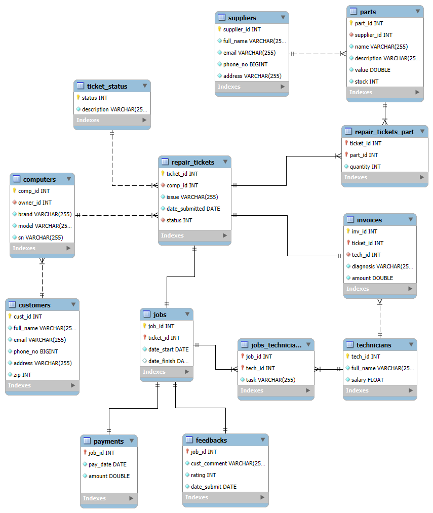

# Computer Repair Service Database

This project is a **relational database** designed for a computer repair shop. The database facilitates efficient management of customer information, repair tickets, parts inventory, technician assignments, and payments. It ensures that all aspects of the repair process are tracked, from when a customer submits a computer for repair to when the job is completed, invoiced, and paid.

## Basic workflow

1. **Customer** registers (New `customers` entry).
2. **Customer** loads **Repair Ticket**, creating a new entry in `computers` (or selecting an existing one), and getting its ID stored in `repair_tickets`, along with the issue with said computer.
3. Any **Technician** can check the **Repair Ticket** and (after adding necessary **Parts** in `repair_ticket_parts`, and removing them from `part.stock`) create an **Invoice** for the customer; changing *status* to 1 (invoice sent).
4. **Customer** then accepts or rejects the invoice and `repair_ticket.status` is changed.
   1. If accepted, and new **Job** entry is created (with automatic values, *date_finish* NULL); new `jobs_technician` with said Job and ID of the technician who made the invoice.
   2. If rejected, the parts taken for the job are returned, if any (`part.stock` is updated again).
5. `repair_ticket.status` is set to 4 when a technician starts with the job.
6. Any technician that takes part in that job will be loaded to `jobs_technician`, declaring what task they are assigned.
7. Once the job is finished, `job.date_finish` is set, `repair_ticket.status` set to 5, and the customer notified.
8. Customer fulfills **Payment**,  `repair_ticket.status` sets to 6 (paid) and user fills **Feedback**.

## Diagram

## Relationships

### One-to-One

* **Repair Tickets to Jobs** : Each repair ticket corresponds to one job, and each job is associated with only one repair ticket. This ensures that a job is created for every repair ticket after the customer accepts the invoice.
* **Jobs to Payments** : Each job has one corresponding payment, and each payment is linked to a single job. This relationship ensures that payments are tracked per job.
* **Jobs to Feedbacks** : Each job has one corresponding feedback entry, and each feedback is linked to one specific job. This allows customers to leave feedback and a rating after a job is completed.
* **Repair Tickets to Invoices** : Each repair ticket has one invoice generated after the technician diagnoses the issue, and each invoice corresponds to one specific repair ticket.

### One-to-Many

* **Customers to Computers** : One customer can own multiple computers, but each computer is associated with one customer.
* **Suppliers to Parts** : One supplier can provide multiple parts, but each part is sourced from a single supplier.
* **Computers to Repair Tickets** : One computer can have multiple repair tickets, but each repair ticket is associated with one computer.

### Many-to-Many (with intermediate tables)

* **Jobs to Technicians** : Multiple technicians can work on the same job, and each technician can work on multiple jobs. This relationship is managed via the `jobs_technicians` table.
* **Repair Tickets to Parts** : A repair ticket can involve multiple parts, and a part can be used in multiple repair tickets. This relationship is managed via the `repair_tickets_part` table.
